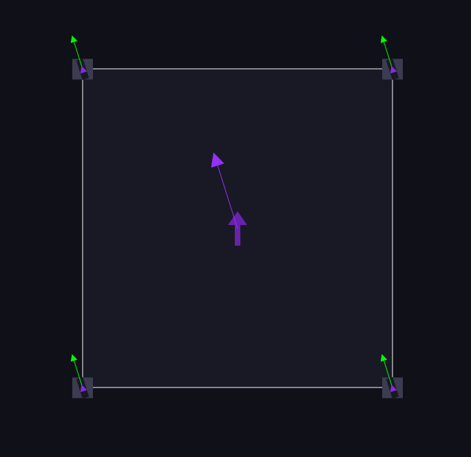
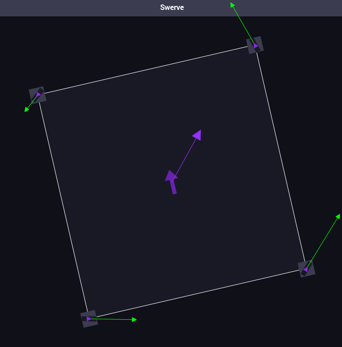
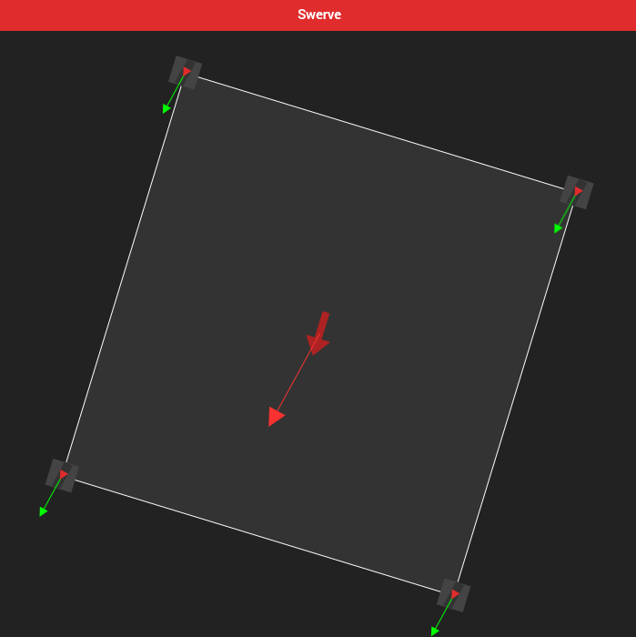
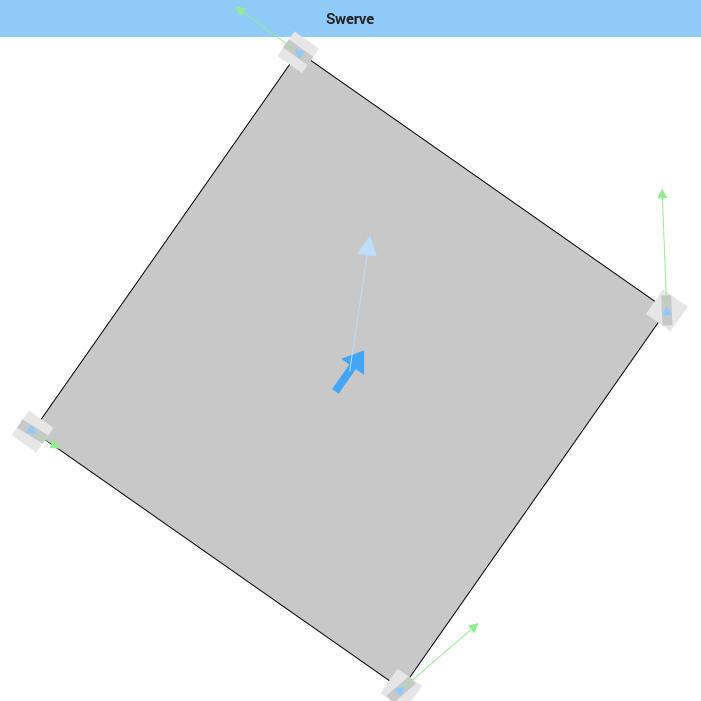

# SwervePlugin

A shuffleboard plugin that displays your robot's swerve drive.

## Downloading

### From source

Clone this repository and run the following command in the root of the project:

```shell
./gradlew installPlugin
```

### Pre-compiled

Download the `SwervePlugin-1.0.0.jar` file from the [latest release](https://github.com/DatAsianBoi123/SwervePlugin/releases).

Navigate to your shuffleboard plugins directory (on windows it can be found at `C:\Users\User\Shuffleboard\plugins`) and move the file there.

---

Open Shuffleboard and check if the plugin was successfully loaded by pressing <kbd>Ctrl</kbd> + <kbd>L</kbd>
and looking for the `com.datasiqn:Swerve Drive Plugin` plugin.

## Usage

In your robot code, create a class that implements `Sendable`.
That class will house all the data used by the widget to display the swerve drive.

In the `#initSendable` method, set the smart dashboard type to `SWERVE_DRIVE`.

Properties are as follows:

| Name            | Type       | Description                                                                                                                                                                                       |
|-----------------|------------|---------------------------------------------------------------------------------------------------------------------------------------------------------------------------------------------------|
| moduleLocations | `double[]` | Module Locations<br/>These are in the format of `[x₀, y₀, ··· , xₙ, yₙ]`                                                                                                                          |
| moduleSpeeds    | `double[]` | Module Speeds<br/>These are in the format of `[v₀, θ₀, ··· , vₙ, θₙ]` where `v` is velocity and `θ` is angle of the wheel in radians where 0 is facing "forward" (CCW+).                          |
| heading         | `double`   | Robot Heading<br/>This is the robot's heading in radians where 0 is facing "forward" (CCW+).                                                                                                      |
| xVelocity       | `double`   | Chassis X Velocity<br/>X velocity of the robot. Positive means in the "forward" direction. This should be in the same units as the velocity in `moduleSpeeds`.                                    |
| yVelocity       | `double`   | Chassis Y Velocity<br/>Y velocity of the robot. Positive means in the "left" direction relative to where the robot is facing. This should be in the same units as the velocity in `moduleSpeeds`. |
| maxVelocity     | `double`   | Max Linear Velocity<br/>The maximum linear velocity of the robot. This value is used to determine lengths of the velocity arrows on both the modules and entire chassis.                          |
| angularVelocity | `double`   | Angular Velocity<br/>Angular velocity of the robot in radians per second (CCW+). This value is currently unused.                                                                                  |

To set properties, use the `SendableBuilder#add TYPE Property` method inside `#initSendable`.

Finally, use the method `ShuffleboardTab#add(String, Sendable)` to display your data in Shuffleboard!

## Screenshots







